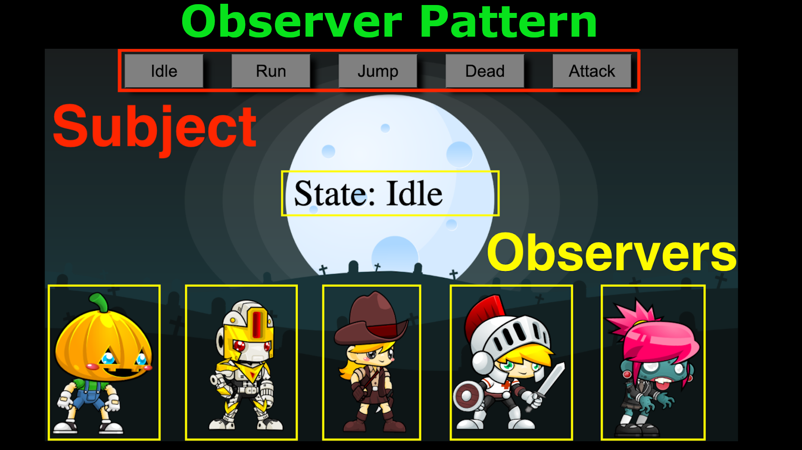

# Observer Pattern

YouTube Link:
https://youtu.be/cR8P1HZAyP8

In this exciting tutorial we are going to learn about the observer pattern. Not your typical observer pattern tutorial, We toss the wikipedia article aside and apply the observer pattern to a simple game.

The images used in this tutorial can be found at
https://www.gameart2d.com/sprites.html

Try it here
https://codingwith-adam.github.io/observer-pattern/index.html
